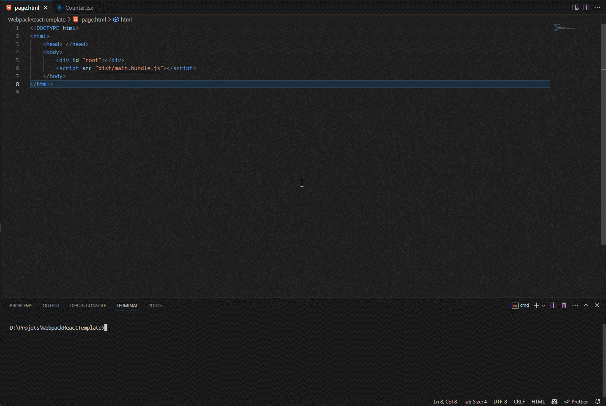

# Webpack Preact Template

This is a template for a really quick creation of Preact project with Webpack build.  
This should be used with Visual Studio Code and the [Live Server extension](https://marketplace.visualstudio.com/items?itemName=ms-vscode.live-server).

## Installation

```bash
npm install -g -D webpack webpack-cli
```

```bash
git clone https://github.com/nicolasventer/WebpackReactTemplate.git
cd WebpackReactTemplate
cd Server
bun install
cd ../Client
bun install
```

### Watch mode installation

```bash
npm install -g nodemon nodemon-webpack-plugin
```

## Demo

*(Gif outdated)*



## Usage

### Only Client (useful for hot reload that keeps the state)

#### Development

In the Client folder:

```bash
bun run dev
```

**WARNING:** Be sure to be exactly in the Client folder, otherwise you will have page not found error.

#### Production

In the Client folder:

```bash
bun run build
```

Then:

```bash
bun run preview
```

### Server and Client

#### Development

In the Client folder:

```bash
bun run watch
```

Then open a new terminal and in the Server folder:

```bash
bun run dev
```

*Note: The client changes will be loaded on the refresh of the page.*

#### Production

In the Client folder:

```bash
bun run wbuild
```

Then open a new terminal and in the Server folder:

```bash
bun run start
```

*Note: You can rebuild the client at any time, the server will serve the new files.*
