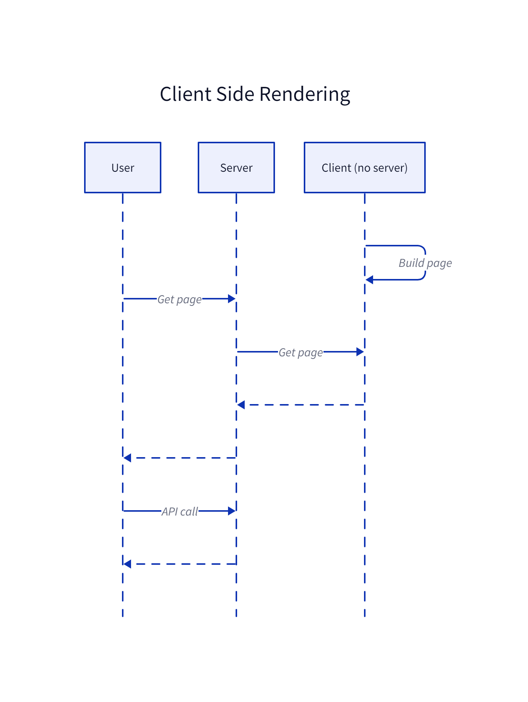

# Preact Project Template

This is a template for a Preact project. It can either be used as a standalone client or as a client for a server.

## Features

- [x] Hot reload (client)
- [x] Watch mode (server)
- [x] Client side renderin
- [x] Tests (server and client)
- [x] Code coverage (server and client)
- [x] Documentation (server and client)

## Installation

### Requirements

```bash
npm install -g -D webpack webpack-cli
npm install -g nodemon nodemon-webpack-plugin
```

### On Windows:

#### Full installation

```bat
git clone https://github.com/nicolasventer/WebpackReactTemplate.git
cd WebpackReactTemplate
all_init_on_cloned.bat
```

#### Manual installation

```bat
mklink /J "Client/src/Common" "Server/src/Common"
```

### On Linux

#### Full installation

```bash
git clone https://github.com/nicolasventer/WebpackReactTemplate.git
cd WebpackReactTemplate
./all_init_on_cloned.sh
```

#### Manual installation

```bash
ln -s Server/src/Common Client/src/Common
```

## Usage

### Only Client (useful for hot reload that keeps the state)

#### Development

In the Client folder:

```bash
bun run dev
```

**WARNING:** Be sure to be exactly in the Client folder, otherwise you will have page not found error.

*Access the client at http://localhost:5173*

#### Production

In the Client folder, run:

```bash
bun run _build
bun run preview
# bun run doc # for documentation
```

*Access the client at http://localhost:4173*

#### Deployment

In the Client folder, run:

```bash
bun run build
```

*In case you have issue with the webpack build, you can use the plugin `vite-plugin-singlefile`.*

Then serve `index.html` and `dist` folder (and optionnaly the `docs` folder) (for example push on github pages).

### Server and Client

#### Development

In the Client folder, run:

```bash
bun run watch
```

*If no server neede, you can consider the usage of the VS Code extension: [Live Server extension](https://marketplace.visualstudio.com/items?itemName=ms-vscode.live-server).*

In the Server folder, run:

```bash
bun run dev
```

*Note: The client changes will be loaded on the refresh of the page.*

#### Production

In the Client folder:

```bash
bun run build
```

*Client is not accessible yet.*

In the Server folder, run:

```bash
bun run start
```

*Note: You can rebuild the client at any time, the server will serve the new files.*

*Access the server at http://localhost:3000/status*

*Acess the client at http://localhost:3000*

#### Deployment

Take `index.html` and `dist` folder from the client and the server code and execute the server.  
You can also take the `docs` folder from the client.

-----

## Project structure


## Tech stack


## Deployment

### Deployed client

In the Client folder, run:

```bash
bun run _build
bun run preview
```

*Access the client at http://localhost:4173*

In the Server folder, run:

```bash
bun run start
```

*Access the server at http://localhost:3000/status*


### Client Side Rendering

In the Client folder, run:

```bash
bun run build
```

*Client is not accessible yet.*

In the Server folder, run:

```bash
bun run start
```

*Access the server at http://localhost:3000/status*

*Acess the client at http://localhost:3000*


